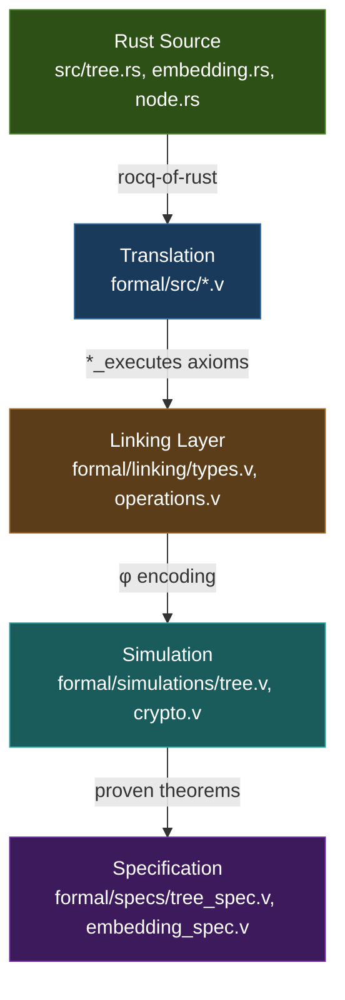

# Rust Implementation ↔ Rocq Formal Model Comparison

This document compares the Rust UBT implementation (`src/`) with the formal Rocq model (`formal/`).

> See also: [formal/docs/RUST_MODEL_COMPARISON.md](../formal/docs/RUST_MODEL_COMPARISON.md) for detailed linking strategy.

## Verification Architecture



**Metrics:** 0 admits | 40 axioms | 26 parameters | 50k QuickChick tests

## Type Correspondences

| Rust Type | Rocq Type | File Location |
|-----------|-----------|---------------|
| `B256` (alloy_primitives) | `Bytes32 := list Byte` | types.v:42-45 |
| `[u8; 31]` | `Bytes31 := list Byte` | types.v:66-74 |
| `Stem` (`[u8; 31]`) | `Stem := mkStem { stem_data : Bytes31 }` | tree.v:24-26 |
| `SubIndex` (`u8`) | `SubIndex := Byte` (Z) | tree.v:29 |
| `TreeKey { stem, subindex }` | `TreeKey := mkTreeKey { tk_stem : Stem; tk_subindex : SubIndex }` | tree.v:32-35 |
| `Node` enum | `SimNode` inductive | tree.v:253-257 |
| `Node::Empty` | `SimEmpty` | tree.v:254 |
| `Node::Internal(InternalNode)` | `SimInternal : SimNode -> SimNode -> SimNode` | tree.v:255 |
| `Node::Stem(StemNode)` | `SimStem : Stem -> SubIndexMap -> SimNode` | tree.v:256 |
| `Node::Leaf(LeafNode)` | `SimLeaf : Value -> SimNode` | tree.v:257 |
| `HashMap<SubIndex, B256>` (StemNode.values) | `SubIndexMap := list (SubIndex * Value)` | tree.v:156 |
| `HashMap<Stem, StemNode>` (tree.stems) | `StemMap := list (Stem * SubIndexMap)` | tree.v:288 |
| `UnifiedBinaryTree<H>` | `SimTree := mkSimTree { st_stems : StemMap }` | tree.v:428-430 |

## Operation Correspondences

| Rust Operation | Rocq Operation | Correspondence |
|----------------|----------------|----------------|
| `UnifiedBinaryTree::new()` | `empty_tree` | tree.v:432 |
| `tree.get(&key)` | `sim_tree_get t k` | tree.v:435-439 |
| `tree.insert(key, value)` | `sim_tree_insert t k v` | tree.v:442-451 |
| `tree.delete(&key)` | `sim_tree_delete t k` (= insert zero32) | tree.v:454-455 |
| `tree.root_hash()` | `sim_root_hash t` | tree.v:744-746 |
| `stem.bit_at(pos)` | `stem_bit_at s i` | tree.v:58-64 |
| `Stem::first_differing_bit` | `first_diff_bit s1 s2` | tree.v:67-81 |

### Hasher Correspondences

| Rust Hasher Method | Rocq Function | Notes |
|--------------------|---------------|-------|
| `Hasher::hash_32(&value)` | `hash_value : Bytes32 -> Bytes32` | crypto.v:62 |
| `Hasher::hash_64(&left, &right)` | `hash_pair : Bytes32 -> Bytes32 -> Bytes32` | crypto.v:63 |
| `Hasher::hash_stem_node(stem, root)` | `hash_stem : Stem -> Bytes32 -> Bytes32` | crypto.v:64 |
| Zero-input special case | `hash_zero_value`, `hash_zero_pair` | crypto.v:143-145 |

## Verified Properties

### Core Correctness Theorems (operations.v, tree.v)

| Property | Theorem | Guarantee |
|----------|---------|-----------|
| Get empty returns None | `get_empty` | `sim_tree_get empty_tree k = None` |
| Insert then get same key | `get_insert_same` | `sim_tree_get (sim_tree_insert t k v) k = Some v` (if v nonzero) |
| Insert doesn't affect other stems | `get_insert_other_stem` | Different stem → lookup unchanged |
| Insert doesn't affect other subindices | `get_insert_other_subindex` | Same stem, different subindex → lookup unchanged |
| Delete removes value | `get_delete` | `sim_tree_get (sim_tree_delete t k) k = None` |
| Insert order independent (different stems) | `insert_order_independent_stems` | Commutative for disjoint stems |
| Insertion preserves well-formedness | `insert_preserves_wf` | `wf_tree t → wf_tree (insert t k v)` |
| Empty tree has zero hash | `empty_tree_hash_zero` | `sim_node_hash SimEmpty = zero32` |
| Empty tree hash (root) | `empty_sim_tree_hash_zero` | `sim_root_hash empty_tree = zero32` |
| Root hash is deterministic | `hash_deterministic_node` | Same tree → same hash |

### Cryptographic Assumptions (crypto.v)

| Property | Axiom | Meaning |
|----------|-------|---------|
| Value collision resistance | `hash_value_collision_resistant` | Equal outputs → equal inputs |
| Pair collision resistance | `hash_pair_collision_resistant` | Equal outputs → both inputs equal |
| Stem collision resistance | `hash_stem_collision_resistant` | Equal outputs → stem_eq and hash equal |
| Second preimage resistance | `hash_value_second_preimage` | Derived: distinct inputs → distinct outputs |
| Domain separation | `hash_value_nonzero` | Derived: non-zero value → non-zero hash |

### Merkle Proof Properties (tree.v:820-956)

| Property | Location | Guarantee |
|----------|----------|-----------|
| Inclusion proof soundness | `inclusion_proof_soundness` (axiom) | Valid proof → value exists in tree |
| Exclusion proof soundness | `exclusion_proof_soundness` (axiom) | Valid proof → key absent from tree |
| Witness collision resistance | `witness_collision_resistant_same_path` | Same path, same root → same leaf hash |
| Batch inclusion soundness | `batch_inclusion_sound` | All proofs in batch valid → each proof valid |
| Batch exclusion soundness | `batch_exclusion_sound` | All exclusion proofs valid |
| Same-key consistency | `batch_same_key_consistent` (axiom) | Same key in batch → same value |

### Refinement Theorems (operations.v)

| Property | Theorem | Guarantee |
|----------|---------|-----------|
| Get refinement | `GetLink.get_refines` | Rust get matches sim_tree_get |
| Insert refinement | `InsertLink.insert_refines` | Rust insert matches sim_tree_insert |
| Delete refinement | `DeleteLink.delete_refines` | Rust delete matches sim_tree_delete |
| Translation equivalence | `translation_simulation_equivalence` | All operations have simulation equivalents |
| Refinement chain | `refinement_chain` | Sequence of ops preserves refinement |
| Batch preserves refinement | `batch_preserves_refinement` | Batch ops preserve refinement |

## Gaps Between Model and Implementation

### 1. Structural Simplifications

| Aspect | Rust Implementation | Rocq Model | Gap |
|--------|---------------------|------------|-----|
| Tree structure | Full binary tree with `rebuild_root()` | Flat `StemMap` without internal nodes | Model doesn't capture tree shape |
| StemNode internals | 8-level subtree hash computation | `hash_stem s zero32` (simplified) | Subtree hashing not fully modeled |
| HashMap implementation | std::collections::HashMap | Association list | Performance model differs |

### 2. Missing from Model

| Feature | Rust Location | Status |
|---------|---------------|--------|
| `rebuild_root()` logic | tree.rs:98-142 | Not modeled (tree shape abstracted) |
| `build_tree_from_stems()` | tree.rs:109-142 | Not modeled |
| Batch insert optimization | tree.rs:169-177 | Not separately modeled |
| Proof generation | proof.rs | Not modeled |
| Iterator implementation | tree.rs:150-156 | Not modeled |

### 3. Axiomatized Execution Theorems (operations.v:983-998)

These theorems are axiomatized (trusted) rather than proven:
- `Run.run_pure`, `Run.run_bind`, `Run.run_panic`
- `GetLink.get_executes`
- `InsertLink.insert_executes`  
- `DeleteLink.delete_executes`
- `HashLink.root_hash_executes`
- `PanicFreedom.*` (get/insert/delete/root_hash no panic)
- `BatchVerifyLink.*` batch verification

### 4. Design Axioms

| Axiom | Location | Justification |
|-------|----------|---------------|
| `stem_eq_true` | tree.v:151 | All well-formed stems are 31 bytes |
| `stem_eq_via_third` | tree.v:388-391 | Transitivity of stem equality |
| `insert_order_independent_subindex` | tree.v:726-731 | SubIndexMap operations commute |

## Trust Assumptions

### Trusted Computing Base (TCB)

1. **Rocq kernel**: Proofs verified by Rocq's type checker
2. **RocqOfRust translation**: Rust→Rocq translation correctness
3. **Cryptographic primitives**: Hash functions satisfy stated properties
4. **Linking axioms**: Monadic execution model is faithful

### What the Proofs Guarantee for Rust Code

**If:**
- The RocqOfRust translation is correct
- The cryptographic assumptions hold (collision resistance, etc.)
- The execution axioms faithfully model Rust semantics

**Then:**
- `get(key)` returns the last inserted value for that key, or None
- `insert(k, v)` followed by `get(k)` returns `Some(v)` (for non-zero v)
- `delete(k)` removes the value at k
- Operations on different stems don't interfere
- Operations on different subindices (same stem) don't interfere
- Tree well-formedness is preserved across operations
- Root hash is deterministic for equivalent trees
- Merkle proofs are sound (if valid, they prove inclusion/exclusion)

### What Is NOT Proven

1. **Memory safety**: Handled by Rust's type system, not Rocq
2. **Concurrency**: Single-threaded model only
3. **Performance**: Complexity bounds not formalized
4. **Actual hash function behavior**: SHA256/BLAKE3 properties assumed, not proven
5. **Panic freedom in all code paths**: Only stated as axioms

## Linking Architecture

```
┌─────────────────────────────────────────────────────────────────┐
│                        Rust Source                              │
│  src/tree.rs, src/node.rs, src/key.rs, src/hash.rs             │
└─────────────────────────────────────────────────────────────────┘
                              │
                              │ RocqOfRust translation
                              ▼
┌─────────────────────────────────────────────────────────────────┐
│                   Translated Rust (M monad)                     │
│  src.tree.tree.Impl_ubt_tree_UnifiedBinaryTree_H.*             │
└─────────────────────────────────────────────────────────────────┘
                              │
                              │ tree_refines relation
                              ▼
┌─────────────────────────────────────────────────────────────────┐
│                   Type Links (linking/types.v)                  │
│  SimTreeLink, StemLink, TreeKeyLink, ValueLink, etc.           │
└─────────────────────────────────────────────────────────────────┘
                              │
                              │ φ encoding
                              ▼
┌─────────────────────────────────────────────────────────────────┐
│                 Simulation Model (simulations/)                 │
│  SimTree, sim_tree_get, sim_tree_insert, sim_tree_delete       │
└─────────────────────────────────────────────────────────────────┘
                              │
                              │ Proven properties
                              ▼
┌─────────────────────────────────────────────────────────────────┐
│               Verified Properties (tree.v, crypto.v)            │
│  Correctness theorems, hash properties, proof soundness        │
└─────────────────────────────────────────────────────────────────┘
```

## Recommendations for Closing Gaps

1. **Model tree structure**: Add `sim_rebuild_root` to capture internal node construction
2. **Prove execution theorems**: Replace axioms with proofs via monadic interpreter
3. **Model subtree hashing**: Full 8-level subtree computation for StemNode
4. **Add panic analysis**: Static analysis to discharge panic-freedom axioms
5. **Performance specification**: Add complexity annotations to operations
